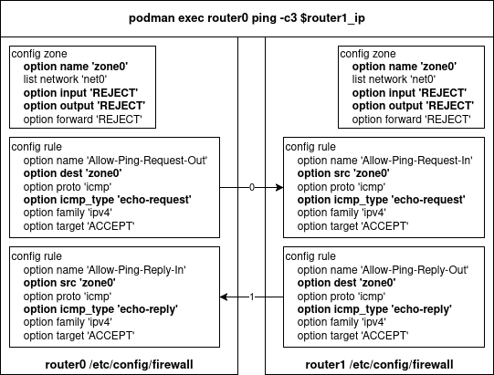

# Podman OpenWrt Firewall Mini‑Lab (ICMP Ping Example)

## Overview
This mini‑lab uses **Podman** to spin up two lightweight OpenWrt router containers and configure their firewalls to control **ICMP (ping)** traffic between them.

It’s designed as a simple, reproducible environment for learning how OpenWrt’s firewall rules work — specifically how to allow or block ping requests and replies using **`src`** and **`dest`** rules with restrictive default policies.

## Prerequisites

Before starting, make sure you have the following:

| Requirement | Minimum Version / Notes |
|-------------|--------------------------|
| **Operating System** | Linux host (tested on EL10) with kernel support for network namespaces |
| **Podman** | v4.x or later, with `podman kube` support |
| **OpenWrt RootFS Image** | `docker.io/openwrt/rootfs:latest` pulled locally |
| **Root / Sudo Access** | Required to enable IP forwarding and manage container networking |
| **YAML & Config Files** | `r0.yaml`, `r1.yaml`, `network_r0`, `network_r1`, `firewall_r0`, `firewall_r1` from this repo |

**Additional Notes:**
- Internet access is required to pull the OpenWrt image if it’s not already cached locally.
- The lab assumes you’re running commands from the project root directory.
- If SELinux is enabled, ensure it’s configured to allow Podman networking.

## Lab Topology

```
[ r0 ] 10.89.0.2/24  <---->  10.89.0.3/24 [ r1 ]
```

- **r0** and **r1** are OpenWrt containers.
- Connected via a Podman network `n0` (`10.89.0.0/24`).
- Default firewall policy: `input REJECT`, `output REJECT`.
- Explicit rules allow ICMP echo‑request and echo‑reply in both directions.

## Project Structure

```
.
├── firewall_r0      # Firewall config for r0
├── firewall_r1      # Firewall config for r1
├── network_r0       # Network config for r0
├── network_r1       # Network config for r1
├── r0.yaml          # Podman kube spec for r0
├── r1.yaml          # Podman kube spec for r1
├── steps.sh         # Setup, test, and cleanup script
└── README.md        # This file
```

## Configuration Details

### `/etc/config/network`

| Router | Interface | Device | IP Address      |
|--------|-----------|--------|-----------------|
| r0     | net0      | eth0   | 10.89.0.2/24    |
| r1     | net0      | eth0   | 10.89.0.3/24    |

### `/etc/config/firewall`

| Router | Zone  | Interface | Default Policy (input/output/forward) | Rules                                                                 |
|--------|-------|-----------|----------------------------------------|-----------------------------------------------------------------------|
| r0     | zone0 | net0      | REJECT / REJECT / REJECT               | Allow-Ping-Request-Out<br>Allow-Ping-Reply-In<br>Allow-Ping-Request-In<br>Allow-Ping-Reply-Out |
| r1     | zone0 | net0      | REJECT / REJECT / REJECT               | Allow-Ping-Request-Out<br>Allow-Ping-Reply-In<br>Allow-Ping-Request-In<br>Allow-Ping-Reply-Out |

## How to Run

### 1. Enable IP forwarding
```bash
sudo sysctl -w net.ipv4.ip_forward=1
```

### 2. Create Podman network
```bash
podman network create --subnet 10.89.0.0/24 n0
```

### 3. Deploy r0
```bash
podman kube play --network n0 r0.yaml
podman cp ./network_r0 r0-r0:/etc/config/network
podman exec r0-r0 /etc/init.d/network restart
podman cp ./firewall_r0 r0-r0:/etc/config/firewall
podman exec r0-r0 /etc/init.d/firewall restart
```

### 4. Deploy r1
```bash
podman kube play --network n0 r1.yaml
podman cp ./network_r1 r1-r1:/etc/config/network
podman exec r1-r1 /etc/init.d/network restart
podman cp ./firewall_r1 r1-r1:/etc/config/firewall
podman exec r1-r1 /etc/init.d/firewall restart
```

## Testing

From **r0**:
```bash
podman exec r0-r0 ping -c3 10.89.0.3
```

From **r1**:
```bash
podman exec r1-r1 ping -c3 10.89.0.2
```

Expected result:
```
3 packets transmitted, 3 packets received, 0% packet loss
```

## Cleanup
```bash
podman kube down r0.yaml
podman kube down r1.yaml
podman network remove n0
```

## How It Works

With `input` and `output` set to `REJECT`, no traffic is allowed unless explicitly permitted.

A ping requires **two ICMP message types**:
- `echo-request` (the ping itself)
- `echo-reply` (the response)

For a ping to succeed:
1. Request must be allowed **out** of the source and **into** the destination.
2. Reply must be allowed **out** of the destination and **into** the source.

Example for `r0 ping r1`:



By creating **four rules** per router (two for each direction), we ensure both request and reply packets are permitted in both inbound and outbound paths.

## Notes
- This lab can be extended to test other protocols (TCP, UDP) by adding corresponding rules.
- You can tighten or loosen rules to observe how the firewall behaves.
- Useful for learning OpenWrt’s `src` vs `dest` rule matching.

> Ty for reading this repo!
>
> Gracias por leer este repo!
>
> Moitas por ler o repo!
